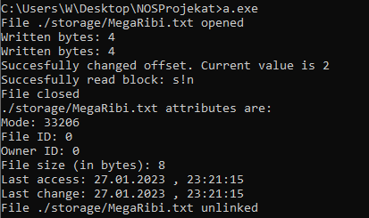
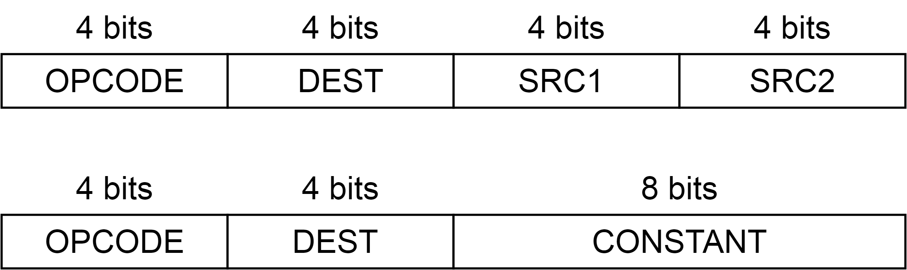

# Process VM SVEU16

### Example code

The example code stored in `kod.s16` is firstly compiled with `asem.c` which turns the instructions to binary form (here named `MegaRo.bin`) then compiled with `NOSProjekat.c`.

The routines that can be called from the VM are:
- stat - returns useful data about a file node.
- creat(name, permissions)
- open(name, mode)
- close(fd)
- unlink(fd)
- read(fd, buffer, n_to_read)
- write(fd, buffer, n_to_write)
- lseek(fd, offest, whence)

The example code uses all the aforementioned, it creates a file `storage/MegaRibi.txt` (if it doesn't already exist), writes `nos!` twice in it, then seeks to position inbetween where it reads `s!n`. After that the file is closed, useful data is shown about the file and then the file is unlinked.
The result in the prompt is as shown.

 ## Instruction-set
 SVEU16 is a RISC type for easier structure. Memory capacity for this processor is 128KB organised as 65536 (216) 16-bit adresses. There is 16 registries, with the last one (R15) being the PC (program counter).
 The instructuin structure is given as 
 
 

 Instruction-set for the SVEU16 processor are given below:

| OP | Operation | Mnemonic | Comment |
| ------ | ------ | ------ | ------ |
| 0000 | DEST = MEM[SRC2] | LOD R1,R2,R3|Reading from memory, memory from position SRC2 is written to destination register|
| 0001 | DEST = SRC1 + SRC2 | ADD R1,R2,R3|Addition|
| 0010 | DEST = SRC1 - SRC2 | SUB R1,R2,R3|Subtraction|
| 0011 | DEST = SRC1 & SRC2 | AND R1,R2,R3|Logical conjunction|
| 0100 | DEST = SRC1 \| SRC2 | ORA R1,R2,R3|Logical disjunction|
| 0101 | DEST = SRC1 ^ SRC2 | XOR R1,R2,R3|Exclusive disjunction|
| 0110 | DEST = SRC1 >>> SRC20-3   DEST = SRC1 >> SRC20-3   DEST = SRC1 rot SRC20-3   DEST = SRC1 << SRC20-3| SHR R1,R2,R3|Rotates SRC1 left/right dependent on the bits 0-3, while 4-5 chooses the type of rotation |
| 0111 | DEST = SRC1 * SRC2 | MUL R1,R2,R3|Multiplication|
| 1000 | MEM[SRC2] = SRC1   DEST = SRC1 | STO R1,R2,R3|SRC1 is written to destination register and memory from position SRC2|
| 1001 | DEST = SRC1SRC2 | MIF R1,R2,R3|SRC1SRC2 is written as 8bit constant to destination register|
| 1010 | DEST = SRC1 > SRC2 | GTU R1,R2,R3|Destination register is 1 if SRC1>SRC2 as unsigned number, else 0|
| 1011 | DEST = +-SRC1 > +-SRC2 | GTS R1,R2,R3|Destination register is 1 if SRC1>SRC2 as signed number, else 0|
| 1100 | DEST = SRC1 < SRC2 | LTU R1,R2,R3|Destination register is 1 if SRC1<SRC2 as unsigned number, else 0|
| 1101 |  DEST = +-SRC1 < +-SRC2 | LTS R1,R2,R3|Destination register is 1 if SRC1<SRC2 as signed number, else 0|
| 1110 | DEST = SRC1 == SRC2 | EQU R1,R2,R3|Destination register is 1 if SRC1==SRC2, else 0|
| 1111 | DEST = SRC1   PC = SRC2 | MAJ R1,R2,R3|SRC1 is written to destination register and program counter becomes SRC2 If SRC1 == PC then the routine, on which SRC2 is pointing, is called while storing the PC in SRC1|
